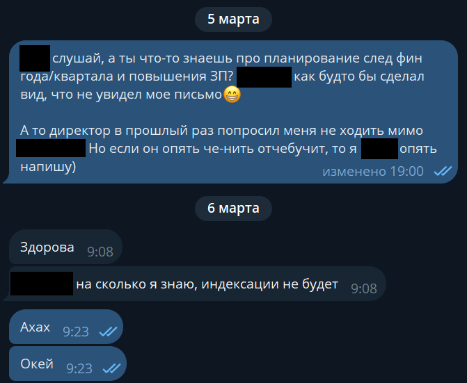
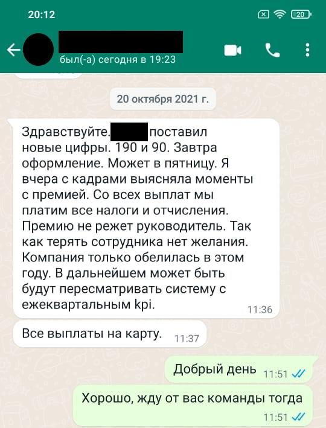
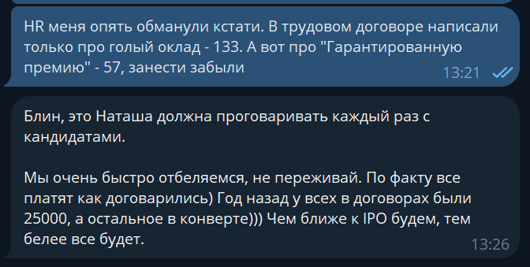

К нам в профсоюз обратился сотрудник «Ситилинка» и поделился своей историей трудового конфликта: в оффере одно, а в договоре другое; перестали платить часть зарплаты; игнорируют и не обсуждают проблемы; пытаются уволить. Дальше весь текст будет от лица автора.

## С чего начался конфликт: «Ситилинк» не индексирует зарплаты с 2021 года

Работаю в компании почти 3 года. За время работы сменилось 4 непосредственных руководителя и 2 директора отдела. И с предыдущим руководством никогда конфликтов не было. Проблемы начались после слияния компаний «Ситилинк» и «Мерлион». Отделы двух компаний объединили, некоторых людей перевели в другие юр.лица, а кого-то отказались переводить, включая меня и моих коллег.

За это время не было ни одного повышения зарплаты ни у одного из коллег, кого я знаю. Почему?

В 2022 году начался кризис, покупателей стало меньше, и руководители сказали: «Нужно потерпеть, повышение будет в следующем году».

К концу года дела стали ещё хуже, началась процедура слияния. За несколько месяцев исчезли целые отделы, сотрудники уходили. Зарплаты не повышали, просили ещё потерпеть. В какой-то момент в нашем отделе осталось 3 человека из 15.

В конце 2023 года пришёл новый директор отдела и с ним 2 руководителя. Им сразу была озвучена проблема с зарплатами. Поначалу выглядело так, будто бы они действительно прониклись этим.

Шёл месяц, второй, прошло полгода. Каждый раз руководство говорило одно и тоже без каких-либо объяснений: «повышений не будет». Стало понятно, что «Ситилинк» ничего не собирается с этим делать, а руководители по-детски отмазываются в надежде, что сотрудники отстанут ещё на пару месяцев или сами уволятся.

С очередного ответа на вопрос о повышении и начинается треш.

А как же положенная индексация зарплаты [по 134 статье ТК РФ](https://www.consultant.ru/document/cons_doc_LAW_34683/12fdabe1c6c090a33e327161c95b4d430b5629c9/)? «Ситилинк» пользуется пробелом в трудовом законодательстве. Пишешь в локальном акте, что индексация проводится только в случае выполнения плана на 90% и при инфляции в стране 12%. И вуаля, можно не индексировать, ведь такая инфляция [последний раз была в 2015](https://xn----ctbjnaatncev9av3a8f8b.xn--p1ai/%D1%82%D0%B0%D0%B1%D0%BB%D0%B8%D1%86%D1%8B-%D0%B8%D0%BD%D1%84%D0%BB%D1%8F%D1%86%D0%B8%D0%B8). Можно и 200% инфляции тогда написать в локальном акте, какая разница?

## «Мы решили с тобой расстаться»

После диалога с руководителем управления я понял, что говорить с ним больше не имеет смысла, и попытался договориться с директором нашего отдела, выше уже только генеральный директор. Написал ему развёрнутое письмо о своём вкладе в развитие компании и результатах, выполненных задачах, выстроенных процессах в командах.

Директор опять попросил меня подождать следующего квартала и обещал выбить повышение в новом финансовом году.

Я честно прождал с начала года 3 месяца и в марте пришёл к своему менеджеру с вопросами. Как вы догадываетесь, повышения так и не случилось. На всякий случай ещё написал письмо директору, но с тех пор он ни разу не ответил.

Прошло несколько дней после этого диалога, мне позвонил руководитель: «Мы решили с тобой расстаться. Позже с тобой свяжется HR, договаривайся с ним сам о том, как это будет происходить».

Подобная ситуация уже происходила с моей коллегой 3 месяца назад, поэтому я знал, что будет дальше.

Через пару часов позвонил HR компании «Мерлион», и у нас состоялся диалог:

--- Мы вас увольняем. Руководители недовольны вашей работой, вы не выполняете задачи в срок и не выполняете их в принципе. Поэтому продолжать работу с вами не хотят. Предлагаем соглашение сторон.

--- Какие условия?

--- Мы выплачиваем вам всё, что положено на дату увольнения + 1 оклад.

--- Об этом не может быть и речи. История про невыполненные задачи --- это чушь. А руководитель решил избавиться от меня, потому что я требую проиндексировать зарплату, поскольку за 3 года работы индексации не было ни разу. А это прямое нарушение ТК, и я буду жаловаться в инспекцию и прокуратуру. Я предлагаю разойтись на 6 зарплатах.

--- Я вас услышала, мне нужно обсудить это с коллегами, и позже я вернусь.

Спустя неделю ожидания мне предложили 2 зарплаты. Ещё через неделю --- 3 зарплаты.

Всё это сопровождалось полным игнором со стороны руководителя направления и директора отдела. Да и непосредственный руководитель писал только тогда, когда ему что-то нужно было узнать.

От всех предложений я отказался.

## «Мы платим всë как положено, честно-честно»

Поделить зарплату на премию и оклад --- распространённая грязная схема работодателей, которую оставляют специально для таких случаев. На примере «Ситилинка» выглядит так: рекрутёр присылает оффер, в котором написано: 190 000 на руки и 90 000 ежеквартальная премия. Ты увольняешься с текущей работы, радостный приезжаешь в офис подписать бумаги, а HR даёт на подпись трудовой договор с окладом в 150 000, то есть 130 000 на руки, а остальные деньги будут платить премией. При этом тебя клятвенно будут убеждать: «Тут у всех так. Мы честные --- выплачиваем, как договаривались. Иди у любого спроси».

И вот начался трудовой спор, и «Ситилинк» перестал выплачивать положенную зарплату целиком, а платит только голый оклад по договору. Также по итогам первого квартала «Ситилинк» не выплатил мне квартальную премию, единственному среди моих коллег. Таким нехитрым образом среднемесячный доход упал на 40%!

На резонный вопрос, что происходит, руководители уходят в глухой игнор и не отвечают ни на одно письмо.

## «Мы всё равно тебя выкинем»

Через несколько дней после отказа от щедрого предложения мне позвонил курьер и сказал, что скоро привезёт «посылку». Это оказалось заказное письмо с уведомлением о сокращении. Я подписал бумаги и принялся изучать их вместе с юристом.

Сейчас мы с юристом готовимся к суду, который состоится сразу после расторжения трудового договора. Я считаю, что сокращение имеет явные признаки фиктивности, когда HR пишет: «Либо 3 зарплаты, либо мы тебя всё равно сократим по ТК». Как показывает судебная практика, судьи такое любят.

Параллельно направили заявления в трудовую инспекцию и в прокуратуру. Причём тут прокуратура? В 2019 году был издан приказ № 196, согласно которому прокуратура обязана принять дополнительные меры к усилению надзора за

соблюдением трудового законодательства.

Попробуйте прикинуть порядок цифр: сколько «Ситилинк» сэкономил за последние годы на отсутствии индексации. Речь ведь не только о зарплатах тысячи сотрудников по всей стране, с этих зарплат компания не выплатила налоги и страховые взносы.

## В заключение

Если вы раздумываете о трудоустройстве в «Ситилинк» или «Мерлион» --- советую хорошо подумать. Зарплату не повышают годами, индексации нет, руководители не способны обсуждать и решать проблемы, а увольнение обосновывают выдуманными причинами.

Ну а если вы уже работаете в «Ситилинке» или «Мерлионе» и тоже хотите отстаивать трудовые права, то пишите в чат-бот профсоюза. Там подскажут, как добиться справедливости.

[Объединяйтесь](https://ruitunion.org/materials) и боритесь за свои права.

#айтистори
