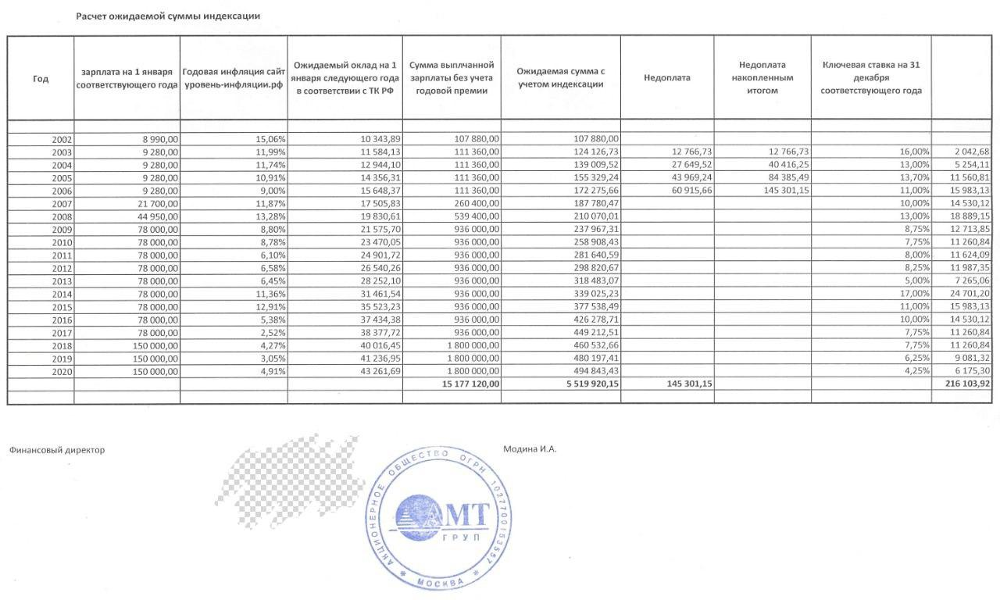

Я работала в [АО «АМТ-ГРУП»](https://www.amt.ru/) с 1999 года в должности специалиста отдела продаж. В 2005 году был заключен трудовой договор о переводе на должность менеджера по работе с ключевыми клиентами, установлен оклад. Оклад повышался доп. соглашениями к трудовому договору до 2008 года и один раз в 2017 году. Я обратилась в суд с иском об индексации зарплаты с 2008 по 2020 гг.

**Из допроса свидетеля Финансового директора АО «АМТ-ГРУП» Модиной И.А.: «**У нас как у коммерческой компании индексация не предполагается*.* Договор предполагает получение оклада и оплаты за выполненные результаты работы по коммерческой части, и он не предполагает индексацию. У истца премии не было.»

Что касается премий, то по [приказу ФНС России от 10.09.2015 N ММВ-7-11/387@](https://www.consultant.ru/document/cons_doc_LAW_188991/949ce1a272e791eea882135dae73a0dc320c2ee0/) легко определяется происхождение любого дохода, с которого был уплачен налог, например:

**2000** - Вознаграждение, получаемое налогоплательщиком за выполнение трудовых или иных обязанностей. При окладной системе это оплата времени выполнения трудовых обязанностей.

**2002** - Суммы премий, выплачиваемых за производственные результаты и иные подобные показатели, предусмотренные нормами законодательства РФ, трудовыми договорами (контрактами) и (или) коллективными договорами. (выплачиваемые не за счет средств прибыли организации, не за счет средств специального назначения или целевых поступлений).

**2003** - Суммы вознаграждений, выплачиваемых за счет средств прибыли организации, средств специального назначения или целевых поступлений. Это премии к юбилеям и другие, не связанные с производственными результатами.

По моим справкам 2-НДФЛ все выплаты имеют код 2000, это оплата отработанного времени, премий действительно не было.

**Головинский районный суд г. Москвы**

[Дело № 2-956/2023](https://www.mos-gorsud.ru/rs/golovinskij/services/cases/civil/details/deb61421-63f7-11ed-b481-11d1185eb367?caseNumber=02-0956/2023)

Истцом заявлены требования о взыскании индексации заработной платы за период трудовой деятельности [с 2005г. по 2021г. включительно].

Проверяя расчет истца о размере сумм индексации, суд отмечает, что [истец осуществляет расчет из установленного оклада, при этом] **[истец не учитывает произведенные ответчиком действия по выплате премии, что в силу локальных актов ответчика рассматривается, как индексация заработной платы]**, в связи с чем с чем суд полагает возможным положить в основу представленный контр.расчет ответчика (л.д. 202 т.3), в связи с чем с ответчика в пользу истца подлежат взысканию индексация заработной платы, [рассчитанная за период с 2008 по 2021г.] в размере 145 301 руб. 15 коп.,, а также компенсация за нарушение сроков выплаты денежных средств в порядке ст.236 ТК РФ в размере 43 261 руб. 69 коп.

Локальных нормативных актов об индексации в деле нет.

Что касается «произведенных ответчиком действий по выплате премии», то в расчетных листках часть выплат указана как «премия».

По поводу очевидного противоречия между справками 2-НДФЛ и расчетными листками Модина И.А. сказала, что АО «АМТ-ГРУП» ведет расчет заработной платы в двух бухгалтериях. Получая расчетные листки из одной из бухгалтерий, я должна была подумать, что все нормально.

В материалах дела есть один приказ о выплате премии. Я получила по банку перевод зарплаты с кодом 2000 раньше даты этого приказа, а расчетного листка на эти выплаты нет вообще.

Несмотря на то, что премий я не получала и знала об этом, в мотивированном решении действия АО «АМТ-ГРУП» по выплате премий рассматриваются как индексация моей заработной платы в силу неназванных локальных нормативных актов. Примечательно, что положенный в основу решения контр.расчет ответчика тоже не содержит никаких премий.

В статье 134 ТК РФ нет формулы расчета индексации. Пользующиеся законом судьи кладут в основу решений базовые определения из статей [134](https://www.consultant.ru/document/cons_doc_LAW_34683/12fdabe1c6c090a33e327161c95b4d430b5629c9/#:~:text=%D0%9E%D0%B1%D0%B5%D1%81%D0%BF%D0%B5%D1%87%D0%B5%D0%BD%D0%B8%D0%B5%20%D0%BF%D0%BE%D0%B2%D1%8B%D1%88%D0%B5%D0%BD%D0%B8%D1%8F%20%D1%83%D1%80%D0%BE%D0%B2%D0%BD%D1%8F%20%D1%80%D0%B5%D0%B0%D0%BB%D1%8C%D0%BD%D0%BE%D0%B3%D0%BE%20%D1%81%D0%BE%D0%B4%D0%B5%), [135](https://www.consultant.ru/document/cons_doc_LAW_34683/ec0a7a4cf2bbf1f8f89970fd480c3fc9ed860f82/) ТК РФ и сравнивают размер установленной трудовым договором заработной платы с ее же размером, повышенным на уровень инфляции.

Судья Кирюхина М.В. положила в основу решения контр.расчет, где установленный моим трудовым договором в 2005, 2006, 2007, 2008, 2017гг. оклад сравнивается с покупательской способностью \$290 по курсу 2002 года (8990 руб).

В 2002 году не было ни трудового договора с окладом, ни должности менеджер по работе с ключевыми клиентами. Получается, что установленный менеджера оклад сравнивается с индексацией не установленного оклада неизвестно кого, не менявшегося с 2002 года.

По контр.расчету ответчика мне присуждено 145 301 руб. 15 коп, из которых недоплатили до \$290:

в 2003г. 12 766 руб. 73 коп.

в 2004г. 27 649 руб. 52 коп.

в 2005г. 43 969 руб. 24 коп.

в 2006г. 60 915 руб. 66 коп.

С 2007 по 2020 годы установленный трудовым договором оклад превышал \$290, поэтому в расчете ответчика индексация 0 и остается 0 на ближайшие лет сто.

В иске был заявлен период индексации 2008-2020гг. Суд в решении написал, что истом были заявлены требования с 2005г. по 2021г. включительно, а решение о взыскании за период с 2008 по 2021г.

И это еще не все. Проценты присуждены строго по расчету ответчика - 216 103,92 руб со ссылкой на ст.236 ТК РФ. Рассчитанный по статье 236 ТК РФ размер процентов составляет 290 121,96 руб. на конец 2020г (разница с расчетом ответчика более 30%), а на день принятия решения 360 358,14 руб. (разница более 60%).

Принимавшая решение судья перешла в Московский городской суд как раз накануне апелляции. В МГС заметили неловкий момент с отсутствием локальных актов и исключили упоминание о них: «суд первой инстанции \...установив, что обязанность по повышению реального содержания заработной платы частично ответчиком выполнялась, в том числе, путем увеличения должностного оклада и выплаты премии, пришел к выводу о частичном удовлетворении данных требований иска.»

**Московский городской суд**

[Дело № 33-42948/2023](https://www.mos-gorsud.ru/mgs/services/cases/appeal-civil/details/016b5f60-5615-11ee-9976-11c3c85178c9)

Решение оставить без изменения.

Толкование индексации по статье 134 ТК РФ как сравнение оклада с произвольной цифрой и как выплата премии в неизвестном направлении выдержало все инстанции. Суды без сомнений наделили АО «АМТ-ГРУП» правом определять преимущественный перед федеральным законом размер процентов, ухудшающий положение работника по сравнению со ст.236 ТК РФ.

**Второй Кассационный суд общей юрисдикции.**

[Дело № 88-4890/2024]

Решения оставить без изменения, кассационную жалобу истца - без удовлетворения.

**Верховный суд**

[Определение № 5-КФ24-2489-К2 от 12 июля 2024г.]

Отказать в передаче кассационной жалобы для рассмотрения в судебном заседании Судебной коллегии по гражданским делам Верховного Суда Российской Федерации.

Отмечу контраст между размытыми формулировками в решениях по данному делу и точными формулами расчетов в мотивированных решениях по другим делам.

Добавлю, что оба адвоката с моей стороны откровенно слились на разных стадиях процесса.

Полагаю, тщательное расследование деятельности АО «АМТ-ГРУП» по «премиям» могло бы стать основанием для пересмотра дела.

Работникам же не рекомендую связываться с компанией АО «АМТ-ГРУП», если не хотите пострадать от перспектив невольного соучастия в их схемах.
