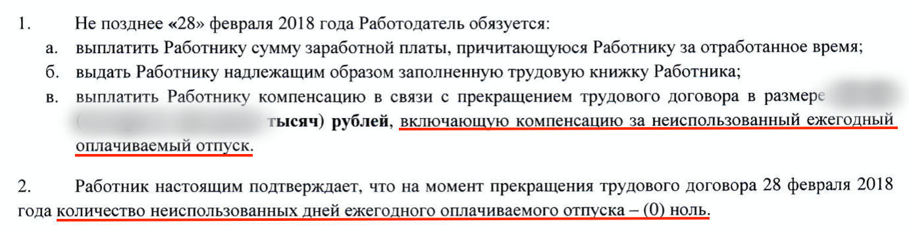
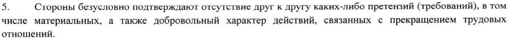

Я работала в коммерческой дирекции [АМТ-ГРУП](http://www.amt.ru/) с 1999 года. Претензий ко мне не было. В ноябре 2016 года поменяли коммерческого директора, и начались странности. В документах стала попадаться ее увеличенная фамилия. 

В феврале 2018 года у нас был «День здоровья» в горнолыжном клубе. Я записалась на то, что умела – горные лыжи и верховая езда, и выслала в кадры рекомендации по безопасности из личного опыта конкура. В день корпоратива было видно, что сотрудницы конюшни старались быстрее пережить нашествие участников, снимали их с лошадей после одного круга и не разрешали ускоряться. Мне позволили немного больше - прокатиться рысью и сделать несколько вольтов. Все прошло отлично.

Почти сразу после корпоратива меня пригласили в кадры и предложили подписать соглашение об увольнении. На вопросы о причинах столь резкой смены настроений мне прямо заявили, что к бизнесу мое увольнение отношения не имеет. Могу только догадываться, что яблоком раздора стало мое владение навыками верховой езды, с учетом того, что на [сайте Федерации конного спорта России](https://fksr.org/?page=object&Guid=8dc07842-64d5-11e0-80f7-0014850b1672) фигурировали ФИО коммерческого директора.

Меня начали регулярно приглашать в начальственные кабинеты под разными предлогами, где требовали **немедленно** подписать это соглашение. При попытке вынести из кабинета эту бумажку для спокойного изучения истерично вырывали ее из рук.

Один экземпляр мне удалось добыть. Глаз сразу зацепился за пункты:  

Какие цели преследовали авторы этих формулировок?

1) Работодатель и так обязан выплатить при увольнении компенсацию всех неиспользованных отпусков [(ст. 127 ТК РФ)](https://www.consultant.ru/document/cons_doc_LAW_34683/2f173da324a5464ef649b88f7347b8a17d200dae/). Математика такова, что если их вычесть, то сверху предлагали заплатить около 0. Ловкость рук, никакого мошенничества.  
     
2) Зачем хотели обнулить неиспользованные отпуска (п.2)? Работодатель безусловно в курсе, сколько их накоплено. Подпись на соглашении не сделает эти отпуска использованными или выплаченными. Так я заподозрила, что компенсацию отпусков по такому соглашению вообще выплачивать не предполагалось.

3) Включает ли компенсация отпуска (п.1) или же они =0 (п.2)? Такая внутренне противоречивая конструкция довольно удобна работодателю и позволяет ему при случае играться с выплатами в нужную сторону. Можно надеяться на то, что неустранимые сомнения будут толковаться против составителя договора (принцип contra proferentem) в пользу слабой стороны отношений - работника. Но так бывает далеко не всегда. 

В соглашении был еще пункт:

Так пытаются внушить, что вы отказываетесь от своих притязаний **безусловно**, и тем самым добровольно отдаете свое право на судебную защиту. Это психологическая уловка для того, чтобы вы и думать забыли об отстаивании своих интересов.

Позже оказалось, что сама коммерческий директор подписала аналогичное соглашение, а затем подала иск в суд на бывшего работодателя из-за невыплаты большей части суммы по нему. Я ходила на слушание этого [дела](https://www.mos-gorsud.ru/rs/presnenskij/services/cases/civil/details/28592cb1-da7e-11ec-8870-97aa1f18e933).

Судья запросила у Ответчика справку о разделении произведенных выплат на компенсацию отпусков и компенсацию за расторжение договора. Ответчик справку не предоставил и всячески увиливал от раскрытия этой информации.   
Тогда суд обратился к справке 2-НДФЛ, и рассмотрел в ней [коды дохода по классификатору из приказа ФНС](https://www.consultant.ru/document/cons_doc_LAW_188991/949ce1a272e791eea882135dae73a0dc320c2ee0/). Выяснилось, что по коду «2013» (сумма компенсации за неиспользованный отпуск) не было выплачено **ни копейки**. 

Истцу присудили компенсацию неиспользованных ежегодных отпусков за все время работы (более 4 лет) с процентами [(ст. 236).](https://www.consultant.ru/document/cons_doc_LAW_34683/7c8d2fe49f0c8b8d13723803f2e82228f99b6d7e/) Сумма получилась внушительная. Общая сумма соглашения была еще больше. Факт наличия соглашения и выходного пособия по нему никто не оспаривал, однако в остальной части иска суд отказал. 

Судебная практика к 2022 году сводилась к отказу во взыскании выходного пособия, если оно не предусмотрено системой оплаты труда. Работодатели могли расставаться с работниками по соглашениям, затем не выплачивать компенсации, а затем еще и выигрывать суды!  
Таким образом АО «АМТ-ГРУП» "прокатили” и своего коммерческого директора.

Для подписавших подобное соглашение о расторжении трудового договора есть хорошие новости:

- Вышло постановление [Конституционного Суда от 13.07.2023 N 40-П](https://www.consultant.ru/document/cons_doc_LAW_452121/), которым он указал судам на **недопустимость ограничивать и привязывать суммы выходных пособий к системе оплаты труда**. Таким образом КС РФ прикрыл работодателям возможность расставаться с работниками с урезанными (вплоть до 0) выплатами. Аллилуйя!

Сейчас бы суд присудил по [делу № 02-6261/2022](https://www.mos-gorsud.ru/rs/presnenskij/services/cases/civil/details/28592cb1-da7e-11ec-8870-97aa1f18e933) и компенсацию за увольнение по соглашению, и компенсацию отпусков, и проценты за задержку всех выплат.

- Практика взыскания компенсация отпусков только за последние три года устарела. Ограничение давно снято [Конституционным судом РФ в Постановлении от 25.10.2018 № 38-П](https://www.consultant.ru/document/cons_doc_LAW_309836/). Например, по [делу № 02-6261/2022](https://www.mos-gorsud.ru/rs/presnenskij/services/cases/civil/details/28592cb1-da7e-11ec-8870-97aa1f18e933) взыскана компенсация более чем за четыре года.

- Выплата компенсации за неиспользованный ежегодный оплачиваемый отпуск по [статье 127 ТК РФ](https://www.consultant.ru/document/cons_doc_LAW_34683/2f173da324a5464ef649b88f7347b8a17d200dae/) - императивная обязанность работодателя. «Императивная» означает, что она не может быть предметом договоренностей. Подписание некоего “признания” об якобы произведенных фактических выплатах положенных компенсаций не лишает работника возможности обратиться в суд с хорошими шансами получить положительное решение. Если же работодатель пытается договориться с вами по поводу компенсации отпусков — стоит насторожиться.

Имейте в виду, что:

- Срок исковой давности причитающихся к выплате при увольнении сумм - 1 год с даты увольнения. Важно не пропустить срок подачи иска.

- Работодатель может принести в суд локальный нормативный акт, который вы впервые там и увидите. Скорее всего, в тайных ЛНА есть внутренняя несвязность и/или противоречия закону. Советую вычитывать их очень и очень внимательно. Попытайтесь понять, что именно от вас скрывал работодатель, сознательно не выполняя свою обязанность знакомить работников с принимаемыми локальными актами [(ст.22 ТК РФ)](https://www.consultant.ru/document/cons_doc_LAW_34683/98b31fb9ec68d01fefb5bb66cad3bfa2c9705789/) до подписания трудового договора [(ст.68 ТК РФ)](https://www.consultant.ru/document/cons_doc_LAW_34683/1d91a5e82050178caef5d0eea647ee6caf4effd1/). Об ознакомлении с ЛНА я напишу отдельно.

В тайном ЛНА АМТ-ГРУП об отпусках за игрой терминов кроется причина сокрытия ответчиком от суда затребованной справки в [деле № 02-6261/2022](https://www.mos-gorsud.ru/rs/presnenskij/services/cases/civil/details/28592cb1-da7e-11ec-8870-97aa1f18e933) (это уже другая история).

Я не стала подписывать это соглашение, хотя за мной бегали с ним почти 3 года. В 2021 году меня уволили по сокращению штата. Казалось бы, хотите сократить – и сокращаете. Но нет, в день выпуска приказа о сокращении финансовый директор писала указания кадрам организовать подписание мной соглашения, а моему руководителю \-«неформально» донести до меня эту мысль. Сокращали весь департамент, уволена по сокращению в итоге оказалась я одна. Остальных убедили «обнулить» отпуска соглашением. 

Последний акт насилия был совершен в день увольнения. Не выдав трудовую книжку и не ознакомив с приказом об увольнении, мне отключили электронный пропуск. Я оказалась запертой одна в помещении в пятницу вечером. Кнопка выхода не работала (а эвакуационные выходы всегда должны быть открыты). Я вызвала полицию, и покинула здание уже вместе с ним. 

Позже я была восстановлена на работе в судебном порядке, после чего меня еще дважды увольняли. На судебном заседании по очередному делу финансовый директор признала намеренный характер того запирание и даже посмеялась. 

Случаи цивилизованного расставания с работниками АМТ-ГРУП мне неизвестны. Уходящим запрещают говорить об увольнении. Локальные акты в компании систематически скрываются. Работники работают по нормам, о которых они и понятия не имеют. 

Не следуйте правилам, которые вам пытаются навязать и которые не понимаете.  
Знайте свои права и объединяйтесь!