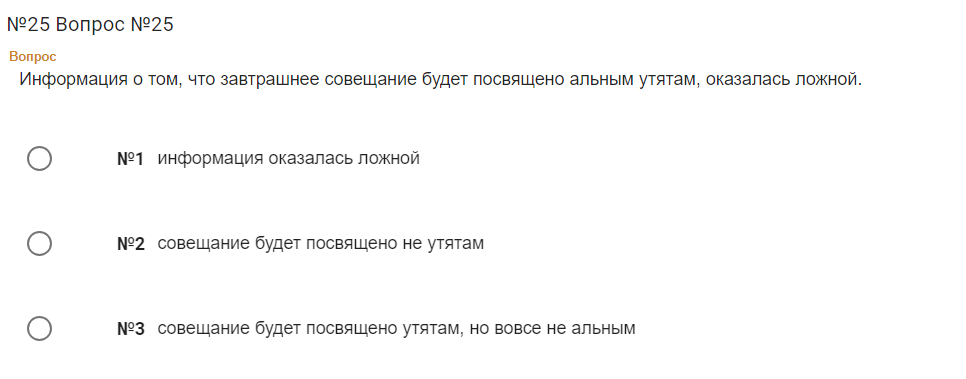

Все с чего-то начинали, в том числе Илон Маск. Только если тот был сыном изумрудного магната, то большинство из нас таких стартовых условий за плечами не имеют. А потому у многих вчерашних студентов  вопрос о первой работе в индустрии и дальнейшем построении карьеры стоит довольно остро. Я выложил резюме на всем известном сайте для поиска ярма себе на шею и принялся изучать, что же всё-таки ждёт молодого и перспективного айтишника после выхода на рынок труда. 

Как честный гражданин, я не стал накручивать себе опыт, а уверенно  в резюме указал — к своим малым годам успел только окончить вуз. Никаких пет-проектов на стороне не делал, в стартапах не участвовал, на стажировки в гугол не ездил. Посему откликаюсь на вакансии, где не ожидают больших знаний и готовы принять неопытного неофита таким, какой он есть: глупым и бесполезным, чтобы сделать из него боевую единицу. 

С чего же начать? Можно попробовать откликаться на все доступные вакансии и мечтать, что рано или поздно тебя пригласят на собеседование и ты его пройдёшь. Можно пойти более длинным путем и сначала попробовать устроится на стажировку. Один из примеров такого предложения можно найти прямо на [хабре](https://habr.com/ru/companies/bastion/news/816003/).

В описании можно найти море красивых слов о том, что вы будете приобщены к святому айти и сможете лично поучаствовать в наступлении светлого будущего, а ещё возможно вас наймут в штат и даже будут платить деньги, наверное. Тем не менее сама стажировка не оплачивается, а гарантий о трудоустройстве никаких нет. В моем случае времени тратить уже нельзя, хочется денег. Возможно, кто-то решится и ему повезёт, а я продолжу поиск. 

Стажировки — не вариант, а потому просто откликаюсь на вакансии без опыта работы. Часто в них ожидают горящие глаза у кандидата и обещают интересные задачи, иногда карьерный рост. Часто высылают тестовые задания. Иногда они крайне оригинальные — меня неиронично отправили проходить тест Белбина на командные роли.  

В одной из вакансий предложили пройти тест на логику, его не стыдно показать тут. Это нужно видеть. 

Вот чем нас приветствует тест. И не просто так на нем присутствует дисклеймер.

Хорошо. Приступим к тесту.

 

 

Это было бы  смешно, если бы не было правдой. Вот что вас ждет, если попытаетесь пробиться на стажировку.

Рано  или поздно соискателя ждёт успех. Но и тут интересное не заканчивается. Есть некоторые компании, которые предлагают работу с обучением. Работника отправляют учиться на сторонний ресурс, а оплату производит работодатель. Если работник увольняется раньше чем, скажем, через два года, по договору он возместить потраченные на него средства. Вот тут уже по-настоящему интересно. С одной стороны, это хоть какая-то возможность начать работать, с другой стороны, а что делать, если в компании происходит ад? Работнику придётся платить из своего кармана, лишь бы из него сбежать. В моем случае мне предложили обучение за 90 тысяч и два года отработки в компании ООО СТЦ, но [сотрудникам компании Aston](https://ruitunion.org/posts/2023-11-18-dream-job/) повезло намного меньше. От предложения я тактично отказался, особенно после того, как в результате в офере сумма заработной платы сократилась до 60к. На собеседовании я озвучивал сумму в 80к, но видимо, никто соискателя в СТЦ не слушает, а смотрит только на число в самом резюме. Видимо, есть смысл ставить значение побольше, чтобы не тратить время попусту. 

Вместе учиться проще. [Объединяйтесь](https://ruitunion.org/posts/2024-05-31-how-to-build-union/).